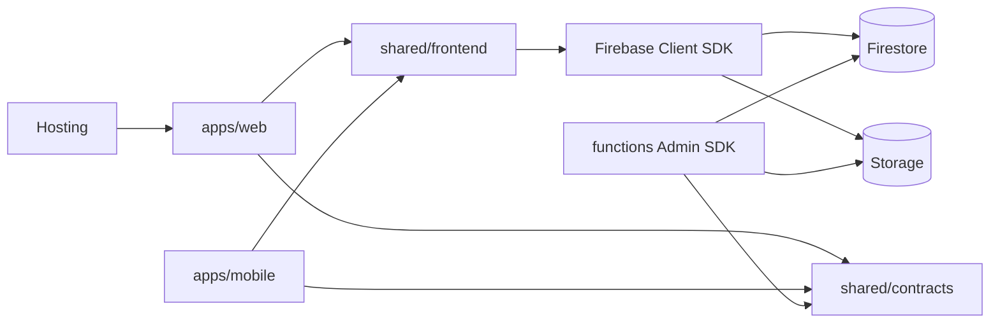

# 03 架構

## 技術棧

| 層 | 選擇 |
| --- | --- |
| 語言 | TypeScript |
| Web／Mobile | Angular 21（zoneless 關閉，兩端都用 `zone.js`，因為 Ionic 需要） |
| Mobile UI | Ionic 9，只允許出現在 `apps/mobile` |
| 原生殼 | Capacitor 8。`webDir` 是根目錄 `www/` |
| 後端 | Firebase：Auth、Firestore、Storage、Hosting、Functions。P0 草案不使用 RTDB、FCM |
| 前端測試 | `ng test`（Vitest） |
| 共用純函式測試 | 根目錄 `tests/unit`（Vitest） |

本機 Node 是 24.13.0。Angular CLI 22 要求 Node `^22.22.3`、`^24.15.0` 或 `>=26`，所以這個 repo 使用 Angular 21.2。Node 升級後再評估 Angular 22，不在這次範圍。

Firebase JS SDK 使用 12.x，對齊目前的 Node。不要為了這個日記自架 REST server。

## 系統

這一版的 Web 與 Mobile 只讀 `shared/frontend/data-access/src/catalog.ts`，不呼叫 Client SDK。Firebase 專案、deny-all rules 與 emulator rules 留在 repo，畫面用不到。

P0 草案沒有任何 Callable。`functions/src` 保持空殼，避免之後把 HTTP API 加進來。Functions 不可 import `shared/frontend`。

## 目錄邊界

與開案說明相同：`apps/web`、`apps/mobile`、`shared/contracts`、`shared/frontend/{ui,styles,data-access,firebase}`、`functions/src/{callable,triggers,lib}`、`tests/{unit,integration,e2e}`、`scripts/`、`tools/`。

| Alias | 實體 | 誰能用 |
| --- | --- | --- |
| `@app/contracts` | `shared/contracts` | Web、Mobile、Functions |
| `@app/frontend/ui` | `shared/frontend/ui` | 僅 Web、Mobile |
| `@app/frontend/data-access` | `shared/frontend/data-access` | 僅前端 |
| `@app/frontend/firebase` | `shared/frontend/firebase` | 僅前端 |
| `@app/frontend/styles` | `shared/frontend/styles` | 僅前端 |

`apps/web` 禁止 import `@ionic/*` 與 `@capacitor/*`。

## 建置

| 指令 | 結果 |
| --- | --- |
| `npm run start:web` | `ng serve web`，port 4200 |
| `npm run start:mobile` | `ng serve mobile`，port 4202 |
| `npm run build:web` | `dist/apps/web/browser` |
| `npm run build:mobile` | 根目錄 `www/` |
| `npm run cap:sync` | 把 `www/` 同步進 `android/`、`ios/` |
| `npm run check` | 邊界檢查 + 兩個 build + `cap sync` |

`www/` 是 Mobile 產物，不手寫、不進 git。Web 不輸出到 `www/`。

Hosting 的 public 目錄是 `dist/apps/web/browser`，所有路徑 rewrite 到 `index.html`。

Capacitor `appId` 暫定 `app.crossfit.diary`，上架前可改，不代表商店資料已建立。

## Firebase 專案

`.firebaserc` 的 default 是 `demo-crossfit`，只給 emulator。`npm run emulators` 讀 `firebase.emulator.json`，只放行 `movements` 與 `sessions`。`firebase.json` 的 rules 全部拒絕。不要 `firebase deploy`。
